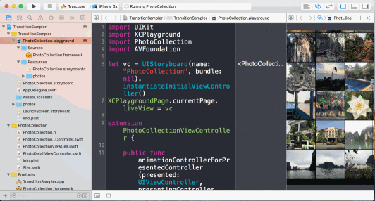

# TransitionSampler

A sample project to run storyboard and animation transition with a playground.

## Demo

## Usage

1. Open `TransitionSampler.xcodeproj`.
2. Build `TransitionSampler` target.
3. Open `PhotoCollection.playground`.
4. Open Assistant Editor.
